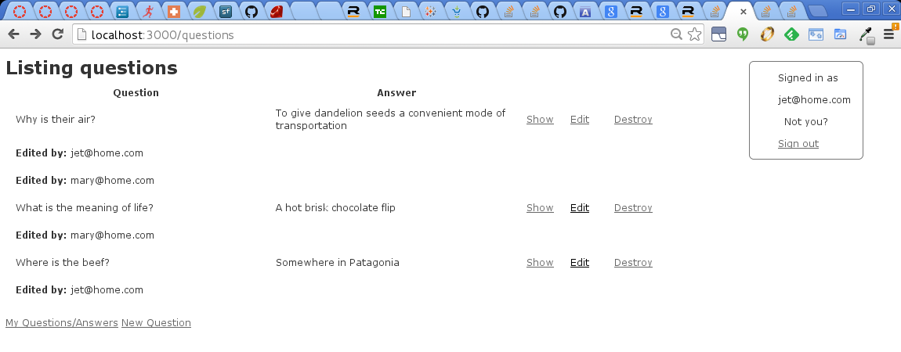
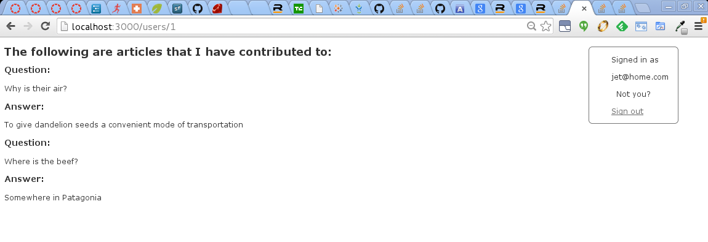

Collaborative Q&A Site
======================

* Ruby 2.1.0
* Rails 4.1.8
* Sqlite3
* Devise

### Configuration

In Gemfile: ``` gem 'devise' ```
Next: ``` bundle exec rails generate devise User ```
Insert into config/environments/development.rb 
``` config.action_mailer.default_url_options = { host: 'localhost', port: 3000 } ```

Follow instructions at https://github.com/plataformatec/devise  for rest of devise configuration.  

In Question Model:

```
has_and_belongs_to_many :users, join_table: 'questions_users', foreign_key: 'question_id'

``` 

In User Model:

```
  has_and_belongs_to_many :questions, join_table: 'questions_users', foreign_key: 'user_id'

```
Run migrations, enjoy life, be happy.


### Index of Questions/Answers



### User Show Page, showing contributions



